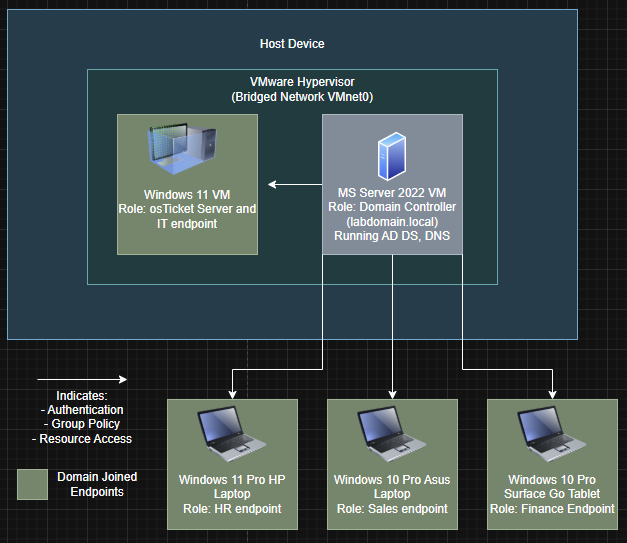

# Active Directory Home Lab

## Overview
This project is a hands-on Active Directory home lab built using Windows Server 2022 and multiple domain-joined endpoints to simulate real-world IT help desk operations. The environment replicates common enterprise workflows, including user management, access control, and software provisioning across multiple departments.

The lab demonstrates practical experience with Active Directory, Group Policy, and troubleshooting common IT support scenarios in a controlled environment.

---

## Objectives
- Simulate real-world IT help desk scenarios  
- Practice Active Directory user and group management  
- Configure and troubleshoot Group Policy Objects (GPOs)  
- Manage user access, permissions, and lifecycle events  
- Demonstrate software deployment and access control in a domain environment

---

## Tools Used

- **Operating Systems:** Windows Server 2022, Windows 11 Pro, Windows 10 Pro 
- **Directory Services:** Active Directory Domain Services (AD DS)  
- **Group Policy Management:** Group Policy Management Console (GPMC)  
- **Ticketing System:** osTicket (self-hosted on Windows 11 VM)
- **Web Server:** IIS
- **Database:** MySQL Server
- **Virtualization:** VMware Workstation  
- **Networking:** DNS, Domain Networking, IP configuration  

---

## Environment / Architecture
The lab environment consists of both virtual machines and physical devices to simulate a small enterprise network:

- **Domain Controller:** Windows Server 2022 (Active Directory, DNS)  
- **IT Workstation / Ticketing Server:** Windows 11 VM (osTicket hosted locally)  
- **Endpoints (Physical Devices):**
  - HR workstation  
  - Sales workstation  
  - Finance workstation  

All endpoints are joined to the domain and organized into appropriate groups to simulate department-based access control.

---

## Key Skills Demonstrated
- Active Directory Users & Computers (ADUC)  
- Group Policy Management (GPO configuration and deployment)  
- User lifecycle management (onboarding and termination)  
- Access control and file permissions  
- Software deployment via network share and GPO  
- Troubleshooting domain, login, and policy issues  
- Basic IT help desk workflow simulation  

---

## Simulated Scenarios
The following real-world IT support scenarios were implemented and tested:

- [Account Lockout](simulations/account-lockout/)  
- [Password Reset](simulations/password-reset/)  
- [New Employee Onboarding](simulations/new-employee-onboarding/)  
- [Folder Access Request (Permissions)](simulations/folder-access/)  
- [Account Disabled (Employee Termination)](simulations/account-disabled/)  
- [Software Deployment via GPO](simulations/software-access/)  

Each scenario includes step-by-step actions, screenshots, and validation of results.

---

## Setup Summary
- Installed and configured Windows Server 2022 as Domain Controller   
- Joined multiple endpoints (VM + physical devices) to the domain
- Set up osTicket on the IT workstation to simulate ticketing workflow    
- Created users associated with endpoints and assigned them to organizational units (OUs)

---

## Architecture

---
