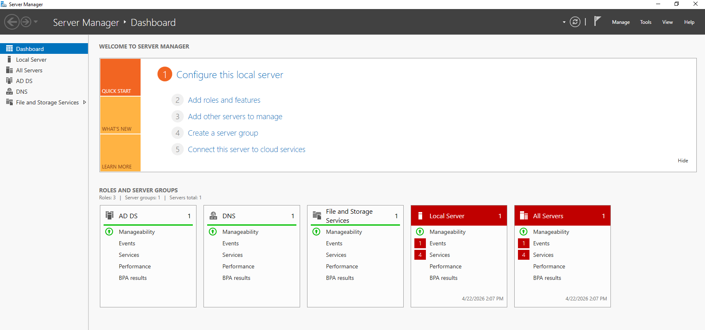
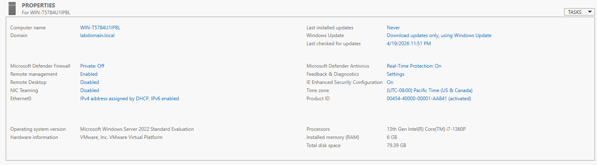
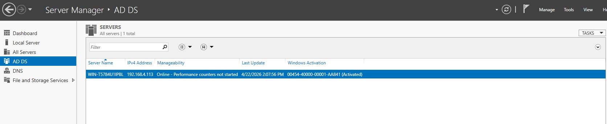
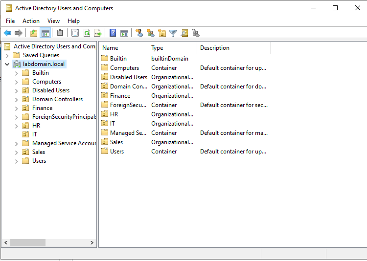
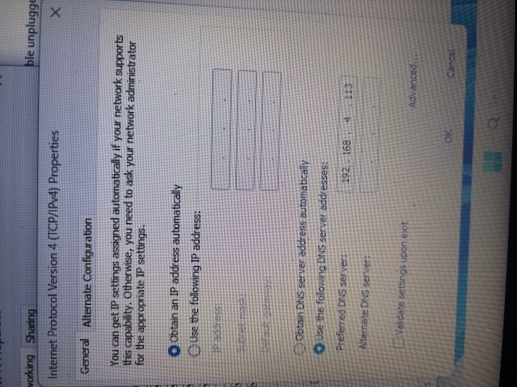
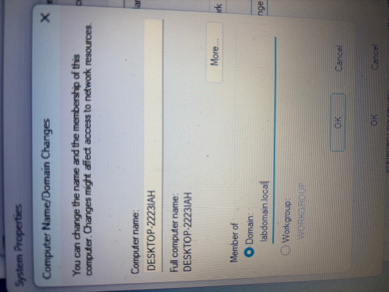
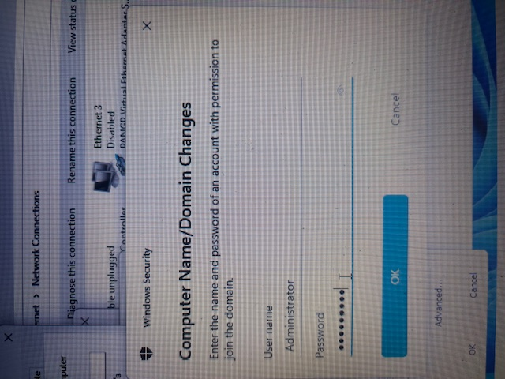
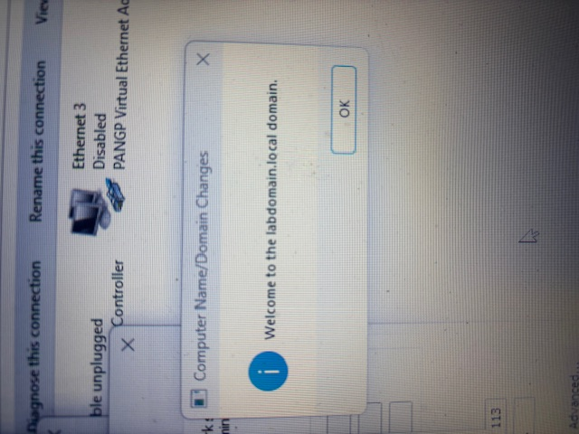
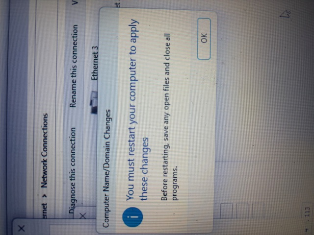

# Domain Controller and Endpoints

## Domain Controller Setup (Windows Server 2022)

### 1. Initial Server Configuration

The domain controller was set up using a Windows Server 2022 virtual machine. After launching the server, I accessed Server Manager to begin configuring the system.

From the dashboard, I verified that the server was running properly and ready for role configuration.
 

---

### 2. Verify Server Properties and Network Configuration

Next, I reviewed the server’s system properties to confirm important configuration details such as:

- Computer name  
- Domain status  
- Network configuration  
- Firewall and remote management settings  
- System resources (CPU, RAM, storage)  

This step ensures that the server is properly configured before promoting it to a domain controller.
  

---

### 3. Install and Configure Active Directory Domain Services (AD DS)

After confirming the server configuration, I installed the Active Directory Domain Services (AD DS) role through Server Manager.

Once installed, the server was promoted to a domain controller, creating a new domain environment.
 

---

### 4. Create and Configure the Domain

During the promotion process, I created a new domain:

- Domain Name: `labdomain.local`

After the domain was created, Active Directory was initialized, and the server became the domain controller responsible for managing users, groups, and devices within the environment.

---

### 5. Verify Active Directory Structure

After the domain was created, I opened Active Directory Users and Computers to verify that the domain structure was properly set up.

Within the domain, I created organizational units (OUs) to simulate a real-world environment, including:

- HR  
- Finance  
- IT  
- Sales  

These OUs allow for structured management of users and devices within the domain.
  

---

### Domain Controller Summary

At this point, the Windows Server 2022 system was fully configured as a domain controller. The server is now responsible for:

- Authenticating users  
- Managing domain-joined devices  
- Enforcing Group Policy  
- Organizing users and departments through OUs  

This provides the foundation for integrating endpoint devices into the domain environment.

## Endpoint Configuration and Domain Join

### 6. Configure DNS Settings on Endpoint Devices

Before joining endpoint devices to the domain, I configured their network settings to ensure they could locate the domain controller.

Specifically, I updated the DNS settings on each endpoint to point to the domain controller’s IP address. This is required because domain name resolution depends on the domain controller’s DNS service.

- Preferred DNS Server: 192.168.4.113  
  

This step ensures that the endpoint can properly resolve the domain name (`labdomain.local`) during the join process.

---

### 7. Join Endpoint to the Domain

After configuring DNS, I joined the endpoint device to the domain.

This was done through the System Properties settings by changing the device membership from a workgroup to a domain:

- Domain: labdomain.local  

---

### 8. Authenticate with Domain Credentials

To complete the domain join process, I provided administrator credentials from the domain controller.

This step verifies that the user has permission to add devices to the domain.
  

---

### 9. Confirm Domain Join Success

After authentication, the system confirmed that the endpoint was successfully joined to the domain.
 

---

### 10. Restart Endpoint to Apply Changes

After joining the domain, the system required a restart to apply the changes.

This is necessary for the device to fully integrate into the domain environment and begin using domain authentication.
 

---

### Endpoint Configuration Summary

At this point, the endpoint device is fully joined to the domain and can:

- Authenticate using domain credentials  
- Access domain resources  
- Receive Group Policy configurations  
- Communicate with the domain controller  

This completes the integration of endpoint devices into the Active Directory environment, allowing for centralized management and realistic IT support scenarios within the lab. A similar process was taken with the remaining endpoints to connect them to the domain.
