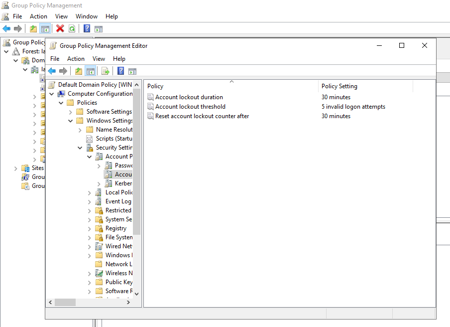
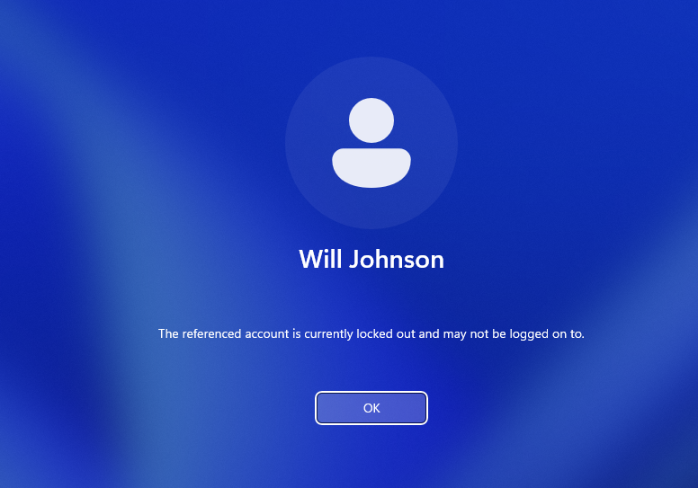
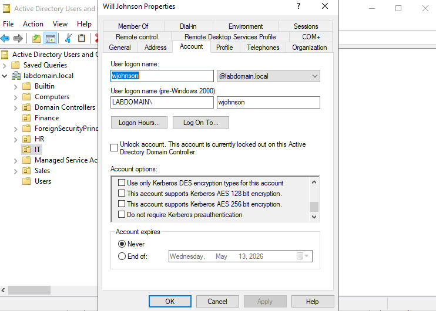
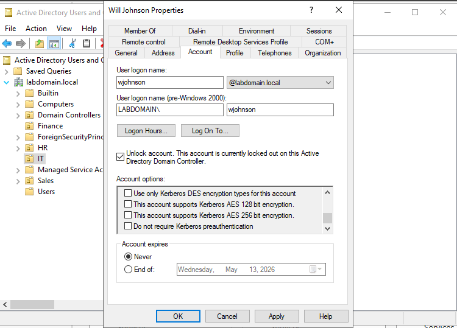
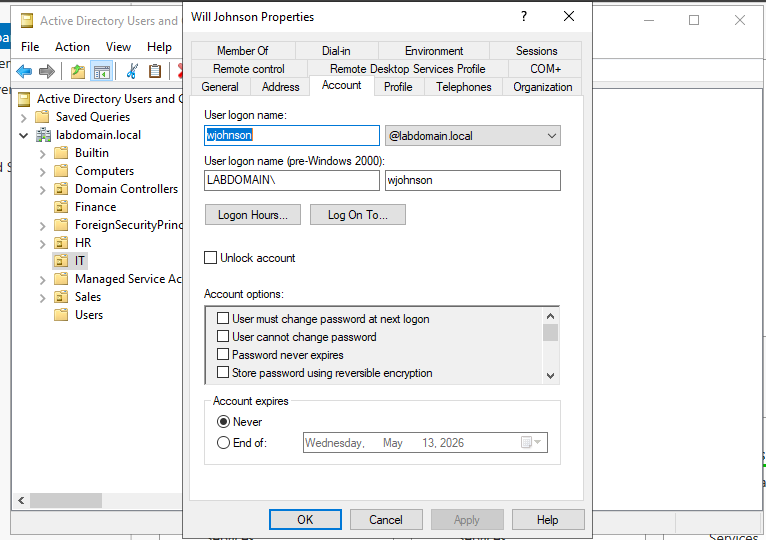

## Account Lockout Simulation

### Scenario Overview
In a typical enterprise environment, an account lockout can occur when a user repeatedly enters an incorrect password due to forgotten credentials. In this scenario, the user **Will Johnson** attempts to log in multiple times with invalid credentials, triggering the domain’s account lockout policy. The IT administrator must then verify the lockout and restore access.

---

### Step 1: Account Lockout Policy Configuration
The domain is configured with a lockout policy that defines how many failed login attempts are allowed before an account is locked.

- Lockout threshold: **5 invalid attempts**
- Lockout duration: **30 minutes**
- Reset counter after: **30 minutes**

---

### Step 2: Failed Login Attempts
The user attempts to log in with incorrect credentials multiple times. The system begins delaying login attempts after repeated failures, indicating that security controls are actively monitoring authentication attempts. After exceeding the allowed number of failed attempts, the account is locked. The user is presented with a message stating that the account is currently locked and cannot be accessed.

---

### Step 3: Account Properties – Locked Status
Within the user’s account properties, the system indicates that the account is currently locked out on the domain controller. This confirms that the lockout policy has been enforced.

---

### Step 4: Unlocking the Account
The administrator selects the **"Unlock account"** option in the account properties. This action restores access to the user without waiting for the lockout duration to expire.

---

### Step 5: Account Restored
After applying the change, the account is successfully unlocked. The user can now log in again with the correct credentials. Notice how There is no longer a check box allowing the administrator to unlock the account

---

### Key Takeaways
- Account lockout policies help prevent brute-force attacks
- Administrators must balance security with usability
- ADUC provides a simple way to identify and resolve locked accounts
- This is a common help desk scenario in enterprise environments
