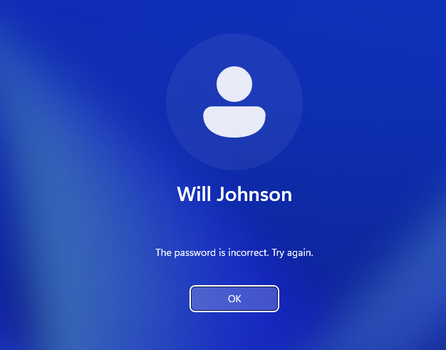
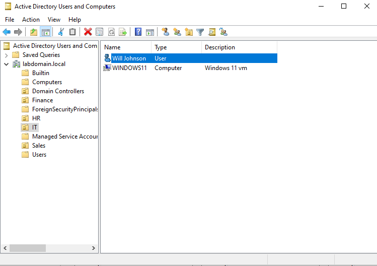
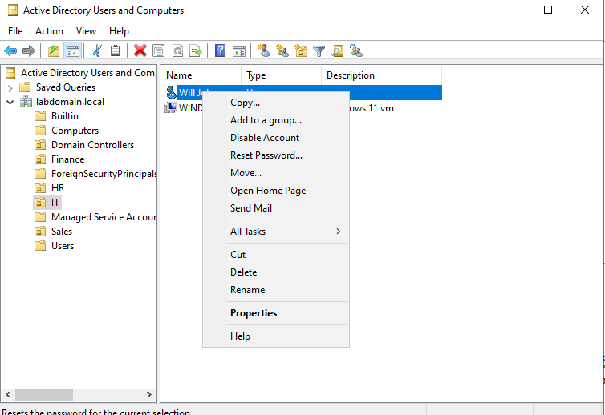
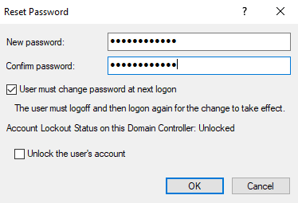
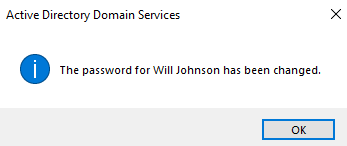
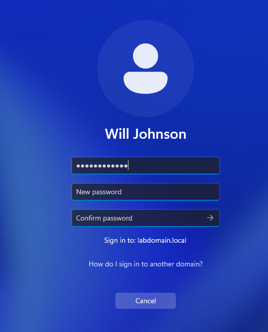

## Password Reset Simulation

### Scenario Overview
In an enterprise environment, password resets are one of the most common help desk requests. Users may forget their passwords or become locked out of their accounts, requiring IT intervention to restore access. In this scenario, the user **Will Johnson** is unable to log in due to an incorrect password and requests assistance. The IT administrator verifies the account and performs a secure password reset through Active Directory.

---

### Step 1: Failed Login Attempt
The user attempts to log in but receives an error indicating that the password is incorrect. This confirms that authentication is failing and a password reset is required.

---

### Step 2: Locate User in Active Directory
The administrator opens **Active Directory Users and Computers (ADUC)** and locates the user account (**Will Johnson**) within the domain.

---

### Step 3: Initiate Password Reset
The administrator right-clicks the user account and selects **"Reset Password"** from the available options.

---

### Step 4: Set New Password
A new password is entered and confirmed. The option **"User must change password at next logon"** is selected to enforce security best practices and ensure the user sets a private password.

---

### Step 5: Password Reset Confirmation
The system confirms that the password for the user has been successfully changed.

---

### Step 6: User Logs In with New Password
The user logs in using the temporary password and is prompted to create a new password, completing the reset process.

---

### Key Takeaways
- Password resets are one of the most frequent help desk tasks  
- Enforcing password change at next login improves security  
- Active Directory provides a quick and controlled method for resetting credentials  
- This process ensures users regain access while maintaining account security  
