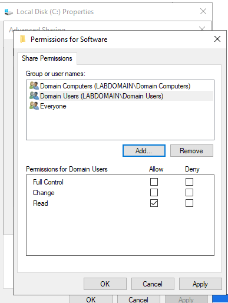
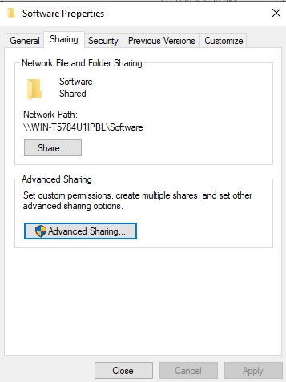
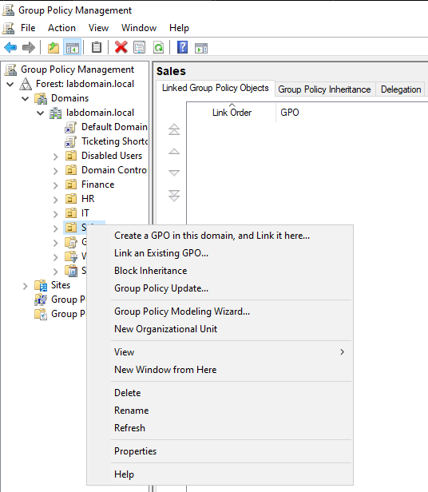
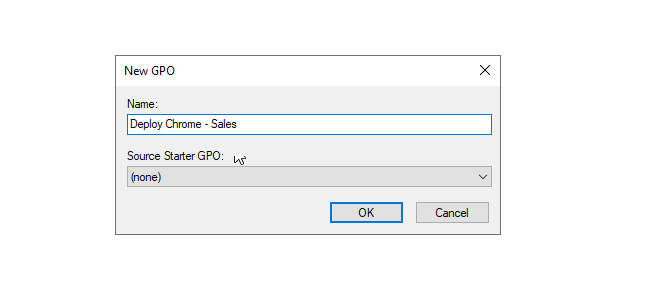
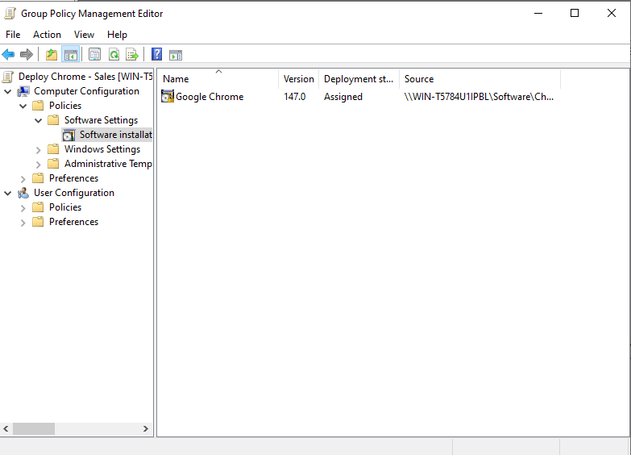
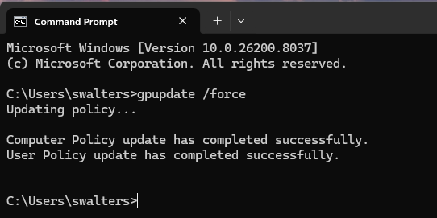
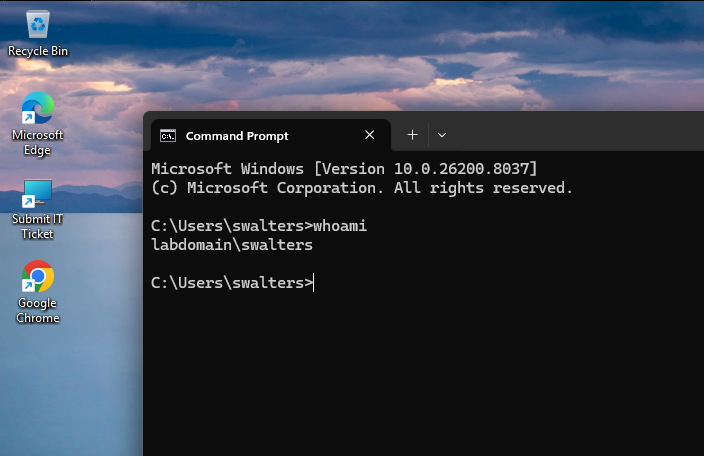

## Software Access Simulation (GPO Deployment)

### Scenario Overview
In an enterprise environment, software is often deployed centrally using **Group Policy Objects (GPOs)** to ensure consistency, security, and ease of management. Instead of allowing users to install applications individually, administrators can provision software directly to users or computers within a specific organizational unit. 

In this scenario, employees in the **Sales department** require **Google Chrome** for their daily work. The IT administrator provisions Chrome using a GPO linked to the Sales organizational unit. This ensures that all users within the Sales group, including **Stacy Walters**, automatically receive the software without manual installation.

---

### Step 1: Configure Shared Software Repository
The administrator creates a shared folder containing the Chrome installation package and configures **share permissions** to allow domain users to access the installer.

---

### Step 2: Verify Network Share Path
The folder is shared on the network and assigned a UNC path (e.g., `\\WIN-XXXX\Software`). This path is required for Group Policy to locate and deploy the application across the domain.

---

### Step 3: Create Group Policy Object for Sales
Within **Group Policy Management**, the administrator creates a new GPO named **"Deploy Chrome - Sales"** and links it to the **Sales organizational unit**.

---

### Step 4: Assign Google Chrome to Sales OU
Google Chrome is configured as an **Assigned** application. This means it will automatically install on machines within the Sales OU during system startup or policy refresh.

---

### Step 6: Force Group Policy Update on Client Machine
On the client machine used by **Stacy Walters**, the administrator runs:

`gpupdate /force`

This command refreshes Group Policy and triggers the software deployment process.

---

### Step 7: Verify User Context
The administrator confirms the logged-in user is part of the Sales domain group by running `whoami`, verifying the session is under **labdomain\swalters**. After the policy update, **Google Chrome** appears on the user's desktop, confirming that the software was successfully provisioned through Group Policy.

---

### Key Takeaways
- GPO-based software deployment allows centralized and automated installation  
- Using a network share ensures all domain machines can access the installer  
- Assigning software ensures it installs automatically without user interaction  
- Group Policy updates (`gpupdate /force`) can accelerate deployment testing  
- This method scales efficiently across large enterprise environments  
